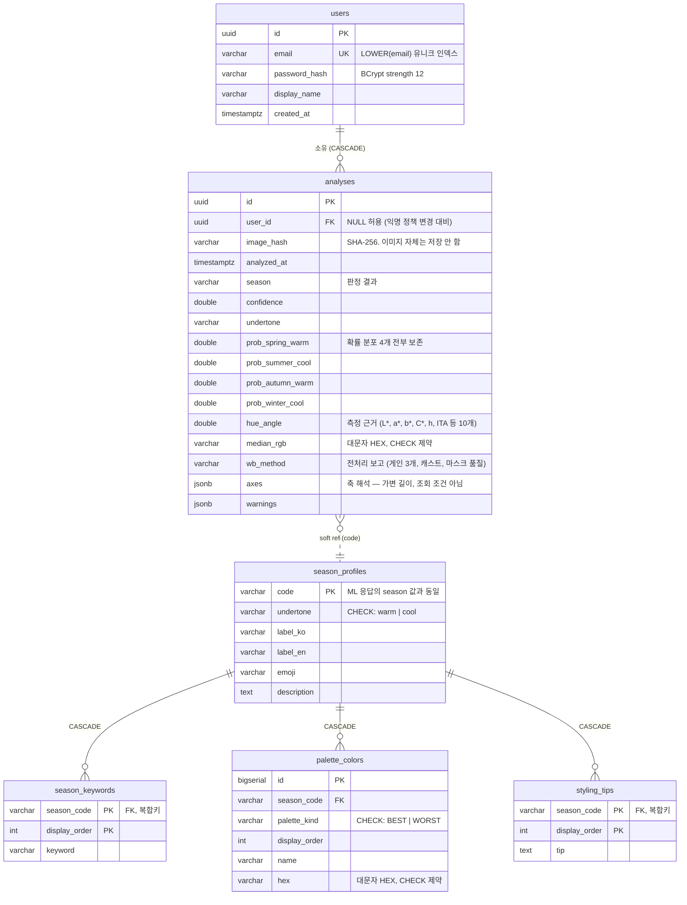

# 사계 (SAGYE) — Personal Color AI

> 얼굴 사진 한 장으로 4계절 퍼스널 컬러를 판정하고, **왜 그렇게 판정했는지를 수치로 설명하는** 서비스. 서비스명 "사계"는 봄·여름·가을·겨울 4계절 판정이라는 정체성에서 왔습니다.
>
> Java 21 · Spring Boot 4.1 · Python 3.12 · FastAPI · Next.js 15 · PostgreSQL 16 · Redis · Docker

[](https://github.com/JUNGMIN0117/warm/actions/workflows/ci.yml)


---

## 한 줄 요약

2022년 대학 팀 프로젝트로 만들었던 **「딥러닝에 기반한 퍼스널 컬러 분석」** 을 4년 뒤 다시 짓는 프로젝트입니다. 원본 소스는 git을 쓰지 않아 유실됐고, 결과보고서와 발표자료만 남았습니다.

**단순 복원이 아닙니다.** 당시 보고서가 결론에 스스로 적어둔 한계를 이번엔 해결하는 것이 목표입니다.

> *"환경·조도·카메라·각도 등 영향을 끼칠 수 있는 변수가 상당히 많아 정밀한 이미지 데이터셋을 만들 수 없다. (…) 얼굴의 윤곽이 학습될 수도 있기 때문에 확실하게 피부색만 추출할 수 있도록 보완할 것이다."*
> — 2022년 결과보고서, 「프로젝트 결과 논의」

| | 원본이 지적한 문제 | 이번 해법 |
|---|---|---|
| **P1** | 조도에 따라 판정이 흔들림 | 화이트밸런스 정규화. 단, **얼굴을 제외한 배경으로** 조명을 추정 ([ADR-004](docs/07-decisions/ADR-004-pipeline-order.md)) |
| **P2** | 피부색이 아니라 얼굴 윤곽이 학습됨 | 분류기 입력을 이미지가 아닌 **색채 통계 벡터**로. 공간 정보가 흐를 경로 자체를 제거 |
| **P3** | 크롤링 라벨(`"웜톤 연예인"` 검색)이 오염됨 | 색채학 규칙 엔진을 기준선으로, 학습 모델은 대조군 ([ADR-002](docs/07-decisions/ADR-002-data-strategy.md)) |

---

## 백엔드 관점에서 봐주셨으면 하는 것

이 저장소에서 제가 신경 쓴 것은 "동작하는 기능"보다 **경계·실패·정직성**입니다.

**계층 경계를 규율이 아니라 빌드가 강제합니다.**
`backend-domain` 모듈의 `pom.xml`에는 테스트용 ArchUnit 외에 의존성이 **하나도 없습니다.** 도메인 클래스에 `@Entity`를 붙이는 순간 컴파일이 깨집니다. 모듈이 못 잡는 규칙(컨트롤러가 리포지토리 직접 호출 등)은 ArchUnit이 맡습니다. → [ADR-006](docs/07-decisions/ADR-006-build-and-modules.md)

**서킷 브레이커가 무엇을 실패로 세는지 정의했습니다.**
"얼굴 없는 사진"은 ML 서비스가 **정상 동작한 결과**이지 장애가 아닙니다. 이걸 실패로 세면 사용자가 잘못된 사진 몇 장을 올린 것만으로 회로가 열려 정상 요청까지 막힙니다. `ignoreExceptions(ImageRejectedException.class)`와 이를 고정하는 테스트가 있습니다.

**"원본 이미지를 저장하지 않는다"를 문서가 아니라 스키마로 강제합니다.**
`analyses` 테이블에는 이미지 컬럼이 아예 없고, `information_schema`를 조회해 그 상태가 유지되는지 확인하는 테스트가 있습니다. 도메인에서도 저장되는 타입과 안 되는 타입을 분리했습니다.

**측정이 제 주장을 반증했을 때 주장을 철회했습니다.**
"Haar Cascade는 오검출이 많다"를 교체 근거로 적었다가, 직접 만든 벤치마크가 그것을 재현하지 못했습니다. 테스트를 원하는 답이 나올 때까지 손보는 대신 근거를 삭제하고 그 경위를 문서에 남겼습니다. → [docs/04 §5](docs/04-preprocessing.md)

**진짜 인프라 위에서 테스트합니다.**
H2를 쓰지 않습니다. 스키마가 `jsonb`·정규식 `CHECK`·함수 인덱스 같은 PostgreSQL 고유 기능에 의존해서, 호환 모드로는 마이그레이션 통과 여부조차 확인할 수 없기 때문입니다. Testcontainers로 PostgreSQL 16과 Redis 7을 실제로 띄웁니다.

---

## 아키텍처

```
┌───────────────┐       ┌──────────────────────────┐       ┌─────────────────┐
│   Next.js 15  │──────▶│    Spring Boot 4.1       │──────▶│    FastAPI      │
│   React 19    │◀──────│    Java 21               │◀──────│   Python 3.12   │
│               │       │  인증 · 이력 · 추천 · 캐시  │       │  측정 · 판정      │
└───────────────┘       └────────────┬─────────────┘       └─────────────────┘
                                     │                          무상태 · 결정론적
                     ┌───────────────┴───────────────┐
                     ▼                               ▼
             ┌───────────────┐              ┌────────────────┐
             │ PostgreSQL 16 │              │     Redis      │
             │  이력 · 팔레트  │              │   측정 캐시     │
             └───────────────┘              └────────────────┘
```

### 왜 두 언어인가

한 언어로 몰아넣는 쪽이 단순합니다. 그럼에도 나눈 이유는 **MediaPipe의 서버사이드 Java 지원이 빈약**하기 때문입니다. 얼굴 랜드마크는 전처리의 핵심이라 거기서 막히면 전체가 막힙니다. 반대로 트랜잭션·인증·스키마 관리는 Spring 생태계가 압도적입니다. → [ADR-001](docs/07-decisions/ADR-001-tech-stack.md)

### 경계를 어디에 그었나

**"측정된 것"과 "우리가 정한 것"** 사이입니다. → [ADR-005](docs/07-decisions/ADR-005-service-boundary.md)

| | 소유 | 이유 |
|---|---|---|
| 색채 통계, 4계절 판정, 확률 분포 | **Python** | 이미지에서 측정된 값 |
| 팔레트, 한국어 라벨, 스타일링 팁 | **Java + DB** | 큐레이션. 재배포 없이 갱신 가능해야 함 |
| 이력, 사용자, 인증 | **Java + DB** | 상태 |

Python이 내보내는 것은 `"autumn_warm"`이라는 **enum 값까지**입니다. 팔레트가 Python 소스에 있으면 색 하나 바꾸는 데 모델 로딩이 무거운 추론 서버를 재배포해야 합니다.

### ML 서비스 호출 — 데코레이터 3겹

```
CachingAnalyzer                     캐시 히트면 아래로 내려가지 않는다
  └─ CircuitBreakingAnalyzer            회로가 열려 있으면 호출하지 않는다
       └─ WebClientPersonalColorAnalyzer    실제 HTTP
```

**순서에 의미가 있습니다.** 캐시가 바깥이어야 ML 서비스 장애 중에도 이미 아는 답은 계속 서빙됩니다. 반대로 두면 회로가 열린 동안 캐시된 결과조차 내주지 못합니다.

캐시 키는 `SHA-256(이미지) + include_stages`입니다. 플래그를 키에서 빼면 단계 이미지 없이 캐시된 응답이 시각화 요청에 반환되어 프론트가 조용히 빈 화면을 띄웁니다.

---

## 기술 스택

### Backend (Java)

| 기술 | 버전 | 선택 이유 |
|---|---|---|
| Java | 21 | record·sealed·패턴 매칭. 도메인 모델이 불변 record로 간결해짐 |
| Spring Boot | **4.1** | 3.x는 start.spring.io에서 제공 종료. 신규 프로젝트에 EOL 버전은 변명이 어려움 |
| Maven | 3.9 (Wrapper) | 빌드 파일을 면접에서 설명할 수 있는가가 결정 요인 ([ADR-006](docs/07-decisions/ADR-006-build-and-modules.md)) |
| Spring Data JPA | Boot 관리 | |
| Spring Security | 7 | JWT 무상태 인증 |
| Flyway | Boot 관리 | 스키마 소유. `ddl-auto=validate`로 엔티티-스키마 불일치를 기동 시 차단 |
| Resilience4j | 2.4 (**코어만**) | Boot 4용 자동설정이 없어 데코레이터로 직접 배선. 결과적으로 동작이 코드에 드러남 |
| jjwt | 0.12.6 | |
| ArchUnit | 1.4 | 모듈이 못 잡는 계층 규칙 검증 |
| Testcontainers | Boot 관리 | 진짜 PostgreSQL·Redis |

### ML Service (Python)

| 기술 | 버전 | 선택 이유 |
|---|---|---|
| Python | 3.12 | |
| FastAPI | 0.141 | OpenAPI 자동 생성, Pydantic 검증 |
| MediaPipe | 1.0 | 478개 얼굴 랜드마크 → 눈·눈썹·입술 폴리곤 제외 가능 |
| OpenCV | 5.0 | 색공간 변환, 마스킹 |
| NumPy | 2.x | 색채 통계 |
| PyTorch | 2.13 (`train` 그룹) | 대조군 CNN 학습·Grad-CAM. **배포 이미지에는 미포함** ([ADR-009](docs/07-decisions/ADR-009-training-stack.md)) |
| uv | 0.12 | 락파일 기반 재현 가능 빌드 |
| pytest · ruff · mypy(strict) | | |

### Frontend (TypeScript)

| 기술 | 버전 | 선택 이유 |
|---|---|---|
| Next.js | 15 (App Router) | rewrites 프록시로 CORS 제거 ([ADR-007](docs/07-decisions/ADR-007-frontend-integration.md)), standalone 출력으로 경량 컨테이너 |
| React | 19 | |
| TypeScript | 5 (strict) | `any` 금지. 게이트웨이 DTO를 타입으로 옮겨 계약 불일치를 컴파일에서 차단 |
| Tailwind CSS | 4 | |
| shadcn/ui | Base UI 기반 | 소유하는 컴포넌트 코드 — 라이브러리 잠금 없이 수정 가능 |
| TanStack Query | 5 | 서버 상태의 단일 출처. mutation 상태가 곧 화면 상태 |
| Motion | 13 | 진행 애니메이션 · 결과 등장 연출 |
| pnpm | 11 | 빌드 스크립트 기본 차단(공급망 방어), `packageManager`로 버전 고정 |
| Vitest + Testing Library | | 렌더링이 아니라 계약을 고정하는 테스트 |

### Infra

PostgreSQL 16 · Redis 7 · Docker

---

## 데이터 모델



### 설계 포인트

**이미지를 담는 컬럼이 없습니다.** 얼굴 사진은 개인정보이고, 보관하면 보관 기간·삭제 요청·암호화 정책이 따라옵니다. 남기는 것은 해시(캐시 키이자 중복 판별자), 측정 수치, 대표 피부색 HEX뿐입니다. 대가로 "이력에서 원본 다시 보기"는 불가능하며, 이력 화면은 색 칩과 3축 게이지로 구성됩니다.

**확률 분포 4개를 모두 저장합니다.** 최상위 계절만 남기면 `62% 봄 / 35% 여름`인 경계 케이스와 `97% 겨울`인 확실한 케이스를 나중에 구분할 수 없습니다.

**`analyses.season`은 FK가 아닌 soft reference입니다.** 의도된 선택입니다. 이 값은 "그 시점에 이렇게 판정했다"는 **역사적 스냅샷**이라, 카탈로그가 바뀌어도 과거 기록은 그대로여야 합니다. 대신 애플리케이션 계층에서 `Season.fromCode()`가 모르는 코드를 즉시 거부하고, 종단 테스트가 세 곳(Python·Java·DB)의 코드 일치를 확인합니다.

**`axes`·`warnings`만 `jsonb`입니다.** 길이가 가변이고 조회 조건이 되지 않아 자식 테이블을 만들 값이 아닙니다. 반대로 조회·집계 대상인 수치는 전부 평면 컬럼입니다.

**인덱스**

| 인덱스 | 대상 | 쿼리 |
|---|---|---|
| `ix_analyses_user_recent` | `(user_id, analyzed_at DESC)` | 이력 조회는 항상 "내 것을, 최신순으로" |
| `ix_analyses_image_hash` | `(image_hash)` | 같은 사진 재업로드 판별 |
| `ux_users_email_lower` | `LOWER(email)` UNIQUE | `citext` 확장 없이 대소문자 무시 유일성 |

**팔레트 시드는 손으로 쓰지 않습니다.** `scripts/export_palettes.py --format sql`이 Python 도메인에서 Flyway 마이그레이션을 생성합니다. 색상 코드 48개를 사람이 옮겨 적으면 오타가 나고, 그 오타는 UI에 이상한 색이 뜰 때까지 발견되지 않습니다.

---

## API

### Spring 게이트웨이 (`/api/v1`) — 프론트엔드가 소비

| 메서드 | 경로 | 인증 | 설명 |
|---|---|---|---|
| `POST` | `/auth/register` | — | 가입. 토큰 즉시 발급 |
| `POST` | `/auth/login` | — | 로그인 |
| `POST` | `/analyses` | **선택** | 분석. 익명 `200`+`saved:false` / 로그인 `201` |
| `GET` | `/analyses` | 필요 | 내 이력 (최신순, 최대 50) |
| `GET` | `/analyses/{id}` | 필요 | 단건. 남의 것은 **404**로 숨김 |
| `GET` | `/seasons` | — | 팔레트 둘러보기 |
| `GET` | `/actuator/health` | — | |

**분석이 익명으로 동작하는 것이 제품 결정입니다.** 첫 사용에 회원가입을 요구하면 사진 한 장 올려보려던 사람이 대부분 떠납니다. 그래서 JWT 필터는 토큰이 없거나 잘못돼도 **거절하지 않습니다** — 거절하면 익명 흐름 자체가 막히기 때문입니다. 응답의 `saved` 필드로 저장 여부를 정직하게 알립니다.

### ML 서비스 (`/v1`) — 게이트웨이만 소비

| 메서드 | 경로 | 설명 |
|---|---|---|
| `POST` | `/v1/analyze` | multipart. `?include_stages=true`로 전처리 단계 이미지 |
| `GET` | `/health` | 모델 로드 여부 포함 (`ok` / `degraded`) |

전체 명세와 오류 코드 표: **[docs/05-api-spec.md](docs/05-api-spec.md)**

### 오류 응답 — 두 서비스 공통

```json
{ "code": "NO_FACE_DETECTED", "message": "얼굴을 찾지 못했습니다. …", "detail": null }
```

`code`가 계약이고 `message`는 사람이 읽는 문구입니다. 4xx와 5xx를 가르는 기준은 **사용자가 사진을 바꿔 고칠 수 있는가**이며, 이 구분이 그대로 서킷 브레이커의 카운팅 기준이 됩니다.

---

## 실행 방법

**Docker만 있으면 됩니다.** JDK나 Python을 설치할 필요 없습니다.

```bash
cp .env.example .env && echo "PCAI_JWT_SECRET=$(openssl rand -base64 48)" >> .env
```

```bash
docker compose up --build --wait
```

다섯 서비스(PostgreSQL · Redis · ML 서비스 · 게이트웨이 · 프론트)가 순서대로 뜹니다. `--wait`는 모든 헬스체크가 통과할 때까지 기다립니다.

**http://127.0.0.1:3000** 에서 바로 써볼 수 있습니다. API를 직접 부르려면:

```bash
curl -F "image=@face.jpg" http://127.0.0.1:8080/api/v1/analyses
```

### 빌드 없이 실행 (게시 이미지)

main에 머지될 때마다 CI가 **종단 기동까지 통과한 커밋만** 이미지 3종을 GHCR에 게시합니다 (`latest` + `sha-<커밋>` 태그 — 정확한 커밋의 조합을 재현할 수 있습니다).

```bash
docker compose -f docker-compose.yml -f docker-compose.ghcr.yml up -d --no-build --pull always
```

### 왜 JWT 키를 직접 만들어야 하나

서명 키에 **기본값을 두지 않았습니다.** 값이 없으면 게이트웨이가 기동을 거부합니다. 기본값은 그대로 배포되고, 소스가 공개된 저장소에서 그것은 누구나 토큰을 위조할 수 있다는 뜻이기 때문입니다.

### 노출되는 포트

| 서비스 | 호스트 | 이유 |
|---|---|---|
| 프론트 | `3000` | 사용자 진입점. `/api/*`를 게이트웨이로 프록시 |
| 게이트웨이 | `8080` | API 진입점 |
| PostgreSQL | `5432` | 데이터 확인용. `.env`의 `DB_PORT`로 변경 가능 |
| Redis | — | Compose 네트워크 내부 전용 |
| ML 서비스 | — | **인증이 없어 외부에 열면 안 됩니다** |

ML 서비스를 직접 만져보려면 `docker-compose.yml`의 해당 `ports` 주석을 푸세요.

<details>
<summary>Docker 없이 로컬에서 직접 실행하기</summary>

JDK 21과 [uv](https://docs.astral.sh/uv/)가 필요합니다. 인프라는 컨테이너로 띄웁니다.

```bash
docker compose up -d db redis
```

모델 가중치는 저장소에 없습니다. 스크립트가 **버전 고정 URL + SHA-256 검증**으로 받습니다.

```bash
cd ml-service && uv sync && uv run python scripts/download_models.py
```

```bash
cd ml-service && uv run uvicorn app.api.main:app --port 8000
```

```bash
cd backend && PCAI_JWT_SECRET=$(openssl rand -base64 48) ./mvnw spring-boot:run -pl backend-api
```

ML 서비스의 Swagger UI는 `http://127.0.0.1:8000/docs` 입니다. Windows에서는 `localhost`가 IPv6로 먼저 해석되는데 uvicorn은 IPv4에만 바인딩하므로 **반드시 `127.0.0.1`** 로 접속하세요.

</details>

---

## 테스트

```bash
cd ml-service && uv run pytest -q && uv run ruff check . && uv run mypy app/ tests/ scripts/
```

```bash
cd backend && ./mvnw verify
```

```bash
cd web && pnpm test && pnpm lint && pnpm typecheck
```

CI(GitHub Actions)가 푸시·PR마다 네 단계를 돕니다 — 서비스별 검증 3개 병렬(Python: ruff·mypy·pytest / Java: `mvnw verify`, Testcontainers 포함 / Node: ESLint·tsc·Vitest·빌드), 컨테이너 이미지 빌드, **Compose 종단 기동**. 마지막 단계는 다섯 서비스가 올바른 순서로 healthy가 되고, 프론트를 경유한 프록시 호출까지 실제 HTTP로 확인합니다.

| 층위 | 무엇이 진짜인가 | 개수 |
|---|---|---|
| 도메인 단위 | 아무것도 (순수 함수) | 93 |
| 어댑터 단위 | HTTP 서버(스텁), 캐시 키, 상관관계 ID 전파 | 20 |
| 웹 슬라이스·필터 | Spring MVC, 보안 필터, 관측성 필터 | 29 |
| 파이프라인·API (Python) | 합성 이미지, TestClient, 관측성 미들웨어 | 77 |
| 영속화 통합 | **PostgreSQL 16** | 17 |
| 종단 통합 | **PostgreSQL + Redis + 전체 컨텍스트** | 16 |
| 프론트 계약 (TypeScript) | jsdom — 오류 매핑 · 토큰 보관 · 확률/경계 표시 | 25 |
| | **합계** | **277** |

**실존 인물 사진이 저장소에 없습니다.** 파이프라인 테스트는 합성 얼굴(피부색 타원 + 도형)로 검증합니다. 눈과 입술을 **일부러 피부색으로 칠해** 색·밝기로는 걸러질 수 없게 만들고, 오직 랜드마크 폴리곤 제외만이 그 픽셀을 제거할 수 있음을 증명합니다.

Testcontainers가 Docker를 요구하므로 Docker가 꺼져 있으면 통합 테스트가 실패합니다. 조용히 skip되어 "통과했다"고 착각하는 것보다 낫다고 판단했습니다.

---

## 주요 설계 결정 (ADR)

| # | 결정 | 핵심 논점 |
|---|---|---|
| [001](docs/07-decisions/ADR-001-tech-stack.md) | Spring + FastAPI 폴리글랏 | MediaPipe 서버사이드 Java 지원이 빈약 |
| [002](docs/07-decisions/ADR-002-data-strategy.md) | 규칙 엔진 우선, 학습은 대조군 | 크롤링 라벨이 오염되어 오차 출처를 분리할 수 없음 |
| [003](docs/07-decisions/ADR-003-classification-scope.md) | 4계절 채택, 8타입 비목표 | |
| [004](docs/07-decisions/ADR-004-pipeline-order.md) | **검출을 화이트밸런스보다 먼저** | 전체 프레임 Gray-World가 피부의 웜기를 조명으로 오인 (`b* 27.6 → 19.3`) |
| [005](docs/07-decisions/ADR-005-service-boundary.md) | 측정=Python, 해석=Spring | 팔레트 변경에 추론 서버 재배포가 필요한 구조 회피 |
| [006](docs/07-decisions/ADR-006-build-and-modules.md) | Maven · 3모듈 · Boot 4.1 | 의존 방향을 컴파일이 강제 |
| [007](docs/07-decisions/ADR-007-frontend-integration.md) | rewrites 프록시 · localStorage 토큰 | CORS 제거, 토큰 권한 크기에 맞춘 방어 수준 |
| [008](docs/07-decisions/ADR-008-observability.md) | 상관관계 ID는 게이트웨이가 발급 · ECS 구조화 로그 | 세 서비스 로그를 요청 하나로, OTel은 아직 과함 |
| [009](docs/07-decisions/ADR-009-training-stack.md) | PyTorch+ONNX · FairFace · 언더톤 우선 | CNN은 제품이 아니라 대조군 — 라이선스가 데이터를 골랐다 |

---

## 알려진 한계

포트폴리오이므로 감추지 않습니다.

**정확도를 주장하지 않습니다.** 캘리브레이션 상수(`hue_center=62°` 등)는 문헌 기반 잠정값이고, 수동 검증셋 평가(Step 5) 전까지 신뢰도 계수와 확률 분포로만 말합니다.

**미측정 항목이 있습니다.** Haar vs MediaPipe 회전 강건성 벤치마크는 스크립트만 준비되어 있고 실제 사진이 없어 비어 있습니다. 마스킹 임계값(팽창 4%, 수축 3%)도 합성 이미지에서 눈으로 정한 값입니다.

**일러스트를 걸러내지 못합니다.** 벤치마크에서 확인했듯 MediaPipe는 만화 얼굴도 검출합니다. 캐릭터 이미지를 올리면 파이프라인이 조용히 결과를 냅니다.

**배경 색이 판정에 영향을 줍니다.** 조명 추정을 배경으로 옮긴 대가입니다. 최악 케이스(단색 배경 75%)에서 색상각이 ±5° 흔들립니다.

**관측성이 없습니다.** 상관관계 ID, 구조화 로그, 서킷 브레이커 상태 노출이 모두 미구현입니다.

**ML 서비스에 인증이 없습니다.** Compose 네트워크로 격리해 호스트에 노출하지 않지만, 이는 배치로 가린 것이지 서비스 자체가 안전해진 것은 아닙니다. 같은 네트워크 안의 다른 컨테이너는 그대로 접근할 수 있습니다.

**배포 파이프라인이 없습니다.** CI는 검증까지만 하고 이미지를 레지스트리에 올리지 않습니다. 배포할 곳이 정해지지 않아 push 단계를 만들지 않았습니다.

---

## 프로젝트 구조

```
personal-color-ai/
├── docker-compose.yml                네 서비스 오케스트레이션
├── .env.example                      필요한 환경변수와 그 이유
├── .github/workflows/ci.yml          CI — 검증 4단계
│
├── backend/                          Spring Boot 게이트웨이 (Maven 멀티모듈)
│   ├── backend-domain/               순수 도메인 — 프레임워크 의존 0
│   │   └── src/main/java/…/domain/
│   │       ├── analysis/             측정·판정 모델, 유스케이스, 포트
│   │       ├── season/               계절 카탈로그
│   │       └── user/                 인증 도메인
│   ├── backend-infrastructure/       어댑터 — JPA · Redis · WebClient
│   │   └── src/main/
│   │       ├── java/…/mlservice/     ML 클라이언트 (데코레이터 3겹)
│   │       ├── java/…/persistence/   엔티티 · 리포지토리 구현
│   │       └── resources/db/migration/  Flyway V1~V3
│   └── backend-api/                  HTTP 경계 — 컨트롤러 · 보안 · 예외 매핑
│
├── ml-service/                       FastAPI 추론 서비스 (무상태)
│   ├── app/
│   │   ├── domain/                   색공간 · 특징 추출 · 규칙 분류기 (I/O 의존 0)
│   │   ├── pipeline/                 검출 · 화이트밸런스 · 마스킹
│   │   └── api/                      HTTP 계층
│   └── scripts/                      모델 다운로드 · 검출기 비교 · 팔레트 export
│
├── web/                              Next.js 프론트엔드
│   └── src/
│       ├── app/                      페이지 — 분석 · 로그인/가입 · 이력
│       ├── components/               캡처 · 진행 애니메이션 · 결과 화면
│       └── lib/                      API 클라이언트 · 타입 · 토큰 보관 · 훅
│
└── docs/                             설계 문서 + ADR
```

---

## 진행 상황

- [x] **Step 0** — 도메인 코어: 색공간 변환 · 특징 추출 · 규칙 기반 분류기
- [x] **Step 1** — 전처리 파이프라인: 얼굴 검출 · 화이트밸런스 · 피부 마스킹
- [x] **Step 2** — FastAPI 무상태 추론 서비스
- [x] **Step 3** — Spring Boot 게이트웨이: 멀티모듈 · JWT · JPA · Redis · 서킷 브레이커
- [x] **Compose · CI** — 네 서비스 컨테이너화, GitHub Actions 4단계 검증 *(Step 6에서 앞당김)*
- [x] **Step 4** — Next.js 프론트엔드: 업로드/웹캠 · 하이브리드 파이프라인 시각화 · 3축 게이지 · 인증/이력
- [x] **Step 5 (도구)** — pseudo-label 생성 · CNN 학습(PyTorch→ONNX) · 평가(일치율·ECE) · Grad-CAM, 합성 데이터로 종단 검증
- [ ] **Step 5 (실행)** — FairFace 실데이터 학습 · 수동 검증셋 라벨링 · Phase 3 비교 평가 (P2 결론)
- [x] **Step 6a** — 관측성: 상관관계 ID 전파(프론트→Spring→FastAPI) · 구조화 로그(ECS/JSON) · 요청 완료 로그
- [x] **Step 6b (릴리스)** — main 머지 시 GHCR 이미지 게시 (종단 검증 통과분만, sha 태그로 재현 가능). *실서버 배포는 하지 않기로 결정*
- [ ] **Step 6b (회고)** — 08-retrospective.md

---

## 문서

| 문서 | 내용 |
|---|---|
| **[docs/README.md](docs/README.md)** | **문서 읽는 순서 — 여기서 시작하세요** |
| [00-overview.md](docs/00-overview.md) | 원본 프로젝트 분석과 재구축 목표 |
| [01-architecture.md](docs/01-architecture.md) | 시스템 구조 — 경계 · 계층 · 데이터 · 오류 흐름 |
| [03-color-theory.md](docs/03-color-theory.md) | 색채 이론과 분류 알고리즘 |
| [04-preprocessing.md](docs/04-preprocessing.md) | 전처리 파이프라인 |
| [05-api-spec.md](docs/05-api-spec.md) | API 명세 (게이트웨이 + ML) |
| [06-frontend.md](docs/06-frontend.md) | 프론트엔드 UX 설계 의도 — 하이브리드 시각화 · 경계 판정 표현 |
| [02-data-pipeline.md](docs/02-data-pipeline.md) | 데이터 수집·pseudo-label 학습·P2 실험 설계 |
| [09-data-model.md](docs/09-data-model.md) | 데이터 모델 상세 — 스키마 설계 근거 |
| [10-engineering-notes.md](docs/10-engineering-notes.md) | **개념 정리 + 면접 대비** |
| [07-decisions/](docs/07-decisions/) | ADR 6건 |
