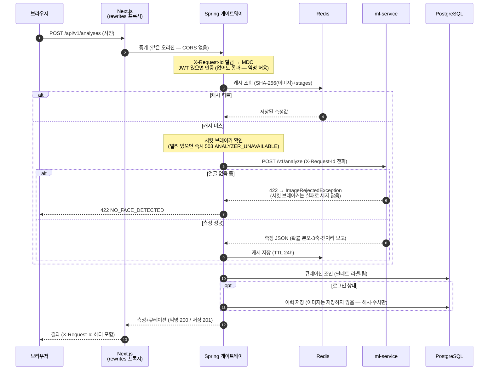
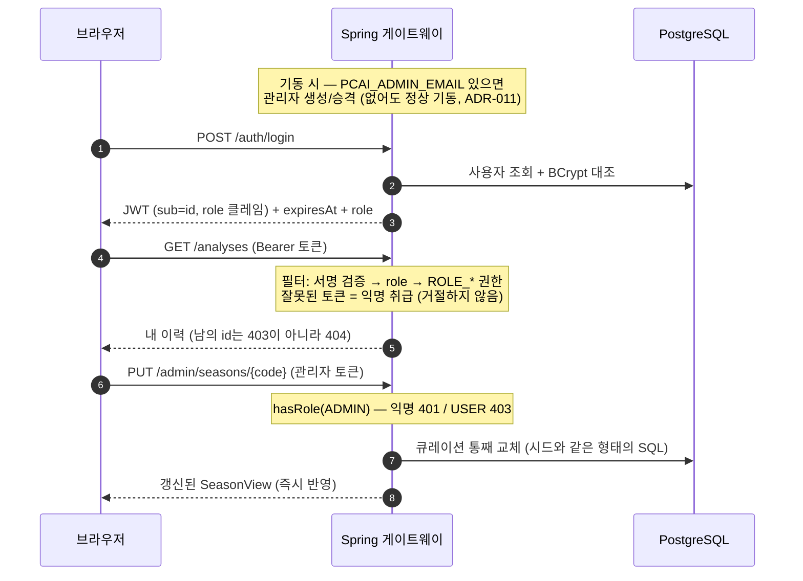

# 01. 시스템 구조

이 문서는 세 서비스가 어떻게 나뉘고 왜 그렇게 나뉘었는지를 설명합니다. 개별 결정의 근거는 ADR에 있고, 여기서는 그 결정들이 합쳐진 **전체 그림**을 다룹니다.

```
┌──────────────┐        ┌─────────────────────────┐        ┌──────────────────┐
│  Next.js 15  │ ─────▶ │   Spring Boot 4.1       │ ─────▶ │  FastAPI         │
│  (Step 4)    │ ◀───── │   Java 21               │ ◀───── │  Python 3.12     │
│              │        │   인증 · 이력 · 추천      │        │  측정 · 판정      │
└──────────────┘        └───────────┬─────────────┘        └──────────────────┘
                                    │                          무상태
                        ┌───────────┴───────────┐
                        ▼                       ▼
                 PostgreSQL 16               Redis
                 이력 · 팔레트                 측정 캐시
```

---

## 1. 왜 두 언어인가

한 언어로 몰아넣는 쪽이 단순합니다. 그럼에도 나눈 이유는 [ADR-001](07-decisions/ADR-001-tech-stack.md)에 있고, 요약하면 **MediaPipe의 서버사이드 Java 지원이 빈약**하기 때문입니다. 얼굴 랜드마크는 이 프로젝트 전처리의 핵심이라 거기서 막히면 전체가 막힙니다. 반대로 트랜잭션·인증·스키마 관리는 Spring 생태계가 압도적입니다.

억지로 한쪽에 몰아넣는 대신 경계를 명확히 긋고 HTTP로 이었습니다. 대가는 네트워크 홉 하나와 배포 단위 둘이고, 얻는 것은 각 영역에서 가장 좋은 도구입니다.

---

## 2. 경계를 어디에 그었는가

가장 많이 고민한 지점입니다 ([ADR-005](07-decisions/ADR-005-service-boundary.md)). 결론은 **"측정된 것"과 "우리가 정한 것"** 사이입니다.

| | 소유 | 이유 |
|---|---|---|
| 피부 색채 통계 (L\*, a\*, b\*, C\*, h°, ITA°) | Python | 이미지에서 측정된 값 |
| 4계절 판정 · 확률 분포 · 3축 근거 | Python | 측정값의 결정론적 함수. 폴백으로 제자리에 있어야 함 |
| 전처리 보고 (WB 게인, 마스킹 품질) | Python | 전처리의 부산물 |
| 계절 팔레트 · 라벨 · 스타일링 팁 | **Java + DB** | 큐레이션. 재배포 없이 갱신 가능해야 함 |
| 분석 이력 · 사용자 · 인증 | **Java + DB** | 상태 |

Python이 내보내는 것은 `"autumn_warm"`이라는 **enum 값까지**입니다. 그것을 "🍂 가을 웜"으로 만들고 팔레트를 붙이는 일은 Java의 몫입니다. 팔레트가 Python 소스에 있으면 색 하나 바꾸는 데 모델 로딩이 무거운 추론 서버를 재배포해야 하기 때문입니다.

이 경계가 조용히 무너지지 않도록 양쪽에서 테스트로 묶어뒀습니다.

- `test_does_not_leak_presentation_concerns` — ML 응답에 `best_colors`·`label_ko`가 없음을 확인
- `test_season_codes_match_palette_export` — ML의 계절 코드와 DB 시드의 코드가 일치함을 확인
- `joinsMeasurementWithCatalog` (종단) — Python → Java → DB 세 곳의 코드가 실제로 조인됨을 확인

---

## 3. 계층 — 같은 규칙을 두 언어로

두 서비스가 **같은 구조**를 씁니다. 의도한 대칭입니다.

```
ml-service/app/                     backend/
 ├ domain/     ← 순수 로직           ├ backend-domain/          ← 순수 로직
 ├ pipeline/   ← 이미지 I/O          ├ backend-infrastructure/  ← DB·HTTP·캐시
 └ api/        ← HTTP               └ backend-api/             ← HTTP
```

핵심 규칙은 하나입니다 — **도메인은 프레임워크를 모른다.** `app/domain/`은 cv2도 fastapi도 임포트하지 않고, `backend-domain`은 Spring도 JPA도 Jackson도 임포트하지 않습니다.

차이는 **강제 수단**입니다. Python 쪽은 규율과 코드 리뷰로 지키고, Java 쪽은 Maven 모듈 경계가 컴파일 단계에서 막습니다 ([ADR-006](07-decisions/ADR-006-build-and-modules.md)). `backend-domain`의 POM에는 ArchUnit(test 스코프) 외에 의존성이 하나도 없어서, 도메인 클래스에 `@Entity`를 붙이는 순간 빌드가 깨집니다.

모듈이 못 잡는 규칙은 ArchUnit이 맡습니다. 실제로 값을 했습니다 — 컨트롤러 둘이 `SeasonProfileRepository`를 직접 주입받고 있었고, 규칙을 느슨하게 푸는 대신 `BrowseSeasonCatalog` 유스케이스를 만들어 고쳤습니다.

### 포트와 어댑터

도메인이 바깥을 부를 때는 **인터페이스(포트)** 를 통합니다.

| 포트 | 구현 | 무엇을 감추는가 |
|---|---|---|
| `PersonalColorAnalyzer` | WebClient → ml-service | HTTP, 재시도, 캐시, 서킷 브레이커 |
| `AnalysisRepository` | Spring Data JPA | 엔티티 매핑, 트랜잭션 |
| `SeasonProfileRepository` | Spring Data JPA | 카탈로그 스키마 |
| `UserRepository` | Spring Data JPA | 사용자 테이블 |
| `PasswordHasher` | BCrypt (Spring Security) | 해싱 알고리즘 |

`PasswordHasher`가 두 줄짜리 위임인데도 존재하는 이유는 방향입니다. 없으면 도메인이 `org.springframework.security`를 임포트하게 되고 규칙이 깨집니다. 부수 이득도 있습니다 — 회원가입 테스트가 실제 BCrypt(의도적으로 느린 알고리즘)를 돌리지 않아도 됩니다.

---

## 4. ml-service 호출 — 데코레이터 세 겹

`PersonalColorAnalyzer` 하나를 세 클래스가 겹쳐 구현합니다.

```
CachingAnalyzer              캐시 히트면 아래로 내려가지 않는다
  └ CircuitBreakingAnalyzer      회로가 열려 있으면 호출하지 않는다
      └ WebClientPersonalColorAnalyzer   실제 HTTP
```

**순서에 의미가 있습니다.** 캐시가 바깥이어야 ml-service 장애 중에도 이미 아는 답은 계속 서빙됩니다. 반대로 두면 회로가 열린 동안 캐시된 결과조차 내주지 못합니다.

### 캐시가 성립하는 이유

ml-service가 **무상태이고 결정론적**이기 때문입니다. 같은 이미지는 항상 같은 결과를 냅니다. 그래서 응답에 타임스탬프나 요청 id를 넣지 않습니다 — 하나만 넣어도 캐시 히트율이 0이 됩니다.

캐시 키는 `SHA-256(이미지) + include_stages`입니다. 플래그를 키에 넣지 않으면 단계 이미지 없이 캐시된 응답이 시각화 요청에 반환되어 프론트가 조용히 빈 화면을 띄웁니다.

캐시 장애는 요청을 실패시키지 않습니다. Redis가 죽었을 때 분석까지 못 하게 되면 캐시가 가용성을 **낮추는** 셈입니다.

### 서킷 브레이커가 무엇을 세는가

이 설정의 핵심은 **`ImageRejectedException`을 실패로 세지 않는 것**입니다. 얼굴 없는 사진은 ml-service가 정상 동작한 결과이지 장애가 아닙니다. 이걸 실패로 세면 사용자가 잘못된 사진 몇 장을 올린 것만으로 회로가 열려 정상 요청까지 막힙니다.

그래서 오류를 두 갈래로 나눕니다. 기준은 **사용자가 사진을 바꿔 고칠 수 있는가**입니다.

```
ml-service 4xx  →  ImageRejectedException      →  게이트웨이 4xx  →  브레이커 무시
ml-service 5xx  →  AnalyzerUnavailableException →  게이트웨이 503  →  브레이커 카운트
타임아웃·연결 실패 →  AnalyzerUnavailableException →  게이트웨이 503  →  브레이커 카운트
```

Resilience4j는 Spring Boot 자동설정 대신 **코어 모듈을 직접 배선**합니다. Boot 4용 스타터가 아직 없고, 그 스타터가 의존하던 `spring-boot-starter-aop`가 Boot 4에서 제거됐기 때문입니다. 결과적으로 애너테이션 뒤에 숨은 동작이 코드로 드러나고, 스프링 컨텍스트 없이 단위 테스트됩니다.

---

## 5. 데이터가 어디에 남고 어디에 남지 않는가

**업로드된 얼굴 사진은 저장하지 않습니다.** 이것이 이 시스템의 데이터 설계에서 가장 중요한 결정입니다.

얼굴 사진은 개인정보이고, 보관하기 시작하면 보관 기간·삭제 요청·암호화 정책이 전부 따라옵니다. 남기는 것은 세 가지뿐입니다.

- **이미지 SHA-256** — 캐시 키이자 "같은 사진인가" 판별자
- **측정 수치** — L\*, a\*, b\*, h°, ITA°, C\*, 확률 분포, 전처리 보고
- **대표 피부색 HEX** — 이력 화면의 색 칩

정책을 문서가 아니라 **스키마와 타입으로** 강제했습니다.

- `analyses` 테이블에 이미지 컬럼이 없고, `schemaCannotStoreImages` 테스트가 `information_schema`를 조회해 그것이 유지되는지 확인합니다.
- 도메인에서도 `AnalysisRecord`(저장됨)와 `StageImages`(저장 안 됨)를 다른 타입으로 갈라, 영속화 경로에 실수로 흘러들기 어렵게 했습니다.

대가는 **"이력에서 원본 다시 보기"가 불가능**하다는 것입니다. 이력 화면은 색 칩과 3축 게이지로 구성됩니다. 프라이버시를 위해 기능을 포기한 것이므로 UI에 그 사실을 명시합니다.

**익명 분석도 저장하지 않습니다.** 소유자 없는 행은 아무도 조회할 수 없으면서 개인정보 성격의 측정값만 쌓기 때문입니다. 반복 요청 비용은 캐시가 흡수합니다.

---

## 6. 인증 — 익명이 기본

**분석은 로그인 없이 됩니다.** 계정은 결과를 나중에 다시 보고 싶은 사람만 만듭니다. 첫 사용에 회원가입을 요구하면 사진 한 장 올려보려던 사람이 대부분 떠납니다.

이 결정이 필터 설계까지 내려옵니다. `JwtAuthenticationFilter`는 토큰이 없거나 잘못돼도 **거절하지 않습니다.** 인증 없이 통과시키고 판단은 인가 규칙에 맡깁니다 — 필터가 401을 던지면 익명 흐름 자체가 막히기 때문입니다. 이 필터의 역할은 "인증 강제"가 아니라 "있으면 알아본다"입니다.

| 엔드포인트 | 인증 | 비고 |
|---|---|---|
| `POST /api/v1/analyses` | 불필요 | 익명 200(`saved:false`) / 로그인 201 |
| `GET /api/v1/analyses` | 필요 | 내 이력 |
| `GET /api/v1/analyses/{id}` | 필요 | 남의 것은 **404**로 숨김 |
| `GET /api/v1/seasons` | 불필요 | 팔레트 둘러보기 |
| `POST /api/v1/auth/*` | 불필요 | |

JWT는 액세스 토큰 하나(12시간)뿐입니다. 리프레시 토큰과 폐기 목록을 두려면 저장소가 필요한데, 로그인의 유일한 용도가 이력 조회라 그 복잡도를 감당할 이유가 없습니다. 무상태 JWT의 값은 서버가 아무것도 기억하지 않는 데 있고, 폐기 목록을 두는 순간 그 값이 사라집니다.

서명 키에는 **기본값이 없습니다.** 환경변수가 없으면 기동이 실패합니다. 기본값은 그대로 배포되고, 소스가 공개된 저장소에서 그것은 누구나 토큰을 위조할 수 있다는 뜻입니다.

---

## 7. 오류가 흐르는 길

같은 원칙이 두 서비스에서 반복됩니다 — **도메인은 HTTP를 모르고, 번역은 경계에서 한 번씩 일어납니다.**

```
[Python]  pipeline 예외  →  error_mapping.py  →  HTTP 상태 + 코드
                                    │
                                    ▼  HTTP
[Java]    MlErrorResponse  →  WebClient 어댑터  →  도메인 예외
                                                        │
                                                        ▼
                                        GlobalExceptionHandler  →  HTTP 상태 + 코드
                                                        │
                                                        ▼  HTTP
[프론트]                              code로 분기, message를 그대로 표시
```

번역이 두 번 일어나는 것이 낭비처럼 보이지만, 그 덕분에 각 계층이 자기 어휘만 씁니다. 파이프라인을 배치 작업으로 재사용해도 HTTP 상태 코드가 따라붙지 않고, 도메인 예외를 CLI에서 던져도 의미가 통합니다.

모든 오류 응답이 같은 형태입니다. `code`가 계약이고 `message`는 사람이 읽는 문구입니다 — 프론트는 코드로 분기하고 메시지는 그대로 보여줍니다.

```json
{ "code": "NO_FACE_DETECTED", "message": "얼굴을 찾지 못했습니다. ...", "detail": null }
```

메시지를 게이트웨이가 다시 쓰지 않는 것도 의도입니다. 실패 원인을 가장 잘 아는 쪽이 측정기이므로, "얼굴이 더 크게 나온 사진을 쓰세요" 같은 안내는 픽셀 수를 아는 쪽에서 나와야 구체적입니다.

---

## 8. 테스트 전략

| 층위 | 무엇이 진짜인가 | 개수 | 속도 |
|---|---|---|---|
| 도메인 단위 | 아무것도 (순수 함수) | 96 (Py 34 + Java 59, 기타 포함) | ms |
| 어댑터 단위 | HTTP 서버(스텁), 캐시 키 계산 | 18 | 초 |
| 웹 슬라이스 | Spring MVC, 보안 필터 | 24 | 초 |
| 영속화 통합 | **PostgreSQL 16** | 17 | 십수 초 |
| 종단 통합 | **PostgreSQL + Redis + 전체 컨텍스트** | 16 | 십수 초 |

**H2를 쓰지 않습니다.** 스키마가 `jsonb`, 정규식 `CHECK`, `LOWER()` 함수 인덱스 같은 PostgreSQL 고유 기능에 의존해서, H2 호환 모드로는 마이그레이션이 통과하는지조차 확인할 수 없습니다. 그러면 통합 테스트가 확인하려던 바로 그것을 확인하지 못합니다.

**ml-service만 스텁입니다.** 컨테이너 이미지가 아직 없기 때문이고(Step 6), 그것도 JDK 내장 `HttpServer`로 **진짜 HTTP 서버**를 세웁니다. 직렬화·오류 번역·타임아웃 같은 실제 실패 지점은 그대로 검증됩니다. Step 6에서 이 스텁을 실제 컨테이너로 바꾸는 것이 자연스러운 다음 단계입니다.

종단 테스트의 HTTP 클라이언트도 JDK 내장 `HttpClient`입니다. `TestRestTemplate`이 Boot 4에서 별도 아티팩트로 분리되면서 의존성이 셋 더 필요해졌는데, 그것보다 JDK에 있는 것을 쓰는 편이 낫다고 판단했습니다. 부수 효과로 이 클라이언트는 스프링을 전혀 모르므로 외부 소비자가 API를 두드리는 방식과 똑같습니다.

---

## 9. 아직 없는 것

정직하게 남깁니다. (이 절은 단계가 진행되며 갱신됩니다 — 아래는 2026-08-12 기준)

**실서버 운영 데이터** — 배포는 GHCR 이미지 게시까지로 결정했습니다(비용 대비 가치). 관측성(상관관계 ID·구조화 로그)은 갖춰져 있지만 실전 트래픽을 본 적이 없습니다.

**통계적으로 유의한 정확도** — 현행 엔진 72.7%(n=55, 확신 케이스 한정)는 구엔진과 통계적 동률입니다. 유의성 있는 주장은 더 큰 검증셋(300장+)의 몫입니다.

**P1(조명 강건성)의 실측** — 동일 인물·다른 조명 사진 쌍이 필요합니다. 화이트밸런스 설계(ADR-004)가 실제로 판정을 안정시키는지는 미검증입니다.

**E2E 브라우저 테스트** — 개발 중 자동화로 확인했지만 회귀 스위트에는 없습니다. 다섯 서비스 Compose 종단 검증이 그 자리의 절반을 메웁니다.

~~프론트엔드 (Step 4)~~ · ~~학습 모델 (Step 5)~~ · ~~컨테이너화와 CI (Step 6)~~ — 완료되어 목록에서 빠졌습니다.

---

## 10. 시퀀스로 보는 요청 흐름

### 분석 요청 — 캐시·서킷·큐레이션 조인이 한눈에



읽는 포인트 셋. **캐시가 서킷보다 바깥**이라 ML 장애 중에도 아는 답은 서빙됩니다(§4). **422는 서킷 카운트에서 제외** — 사진 문제는 장애가 아닙니다(§4). **큐레이션은 캐시 뒤에서 조인** — 그래서 관리자가 팔레트를 편집하면 캐시 무효화 없이 즉시 반영됩니다(ADR-011).

### 인증과 권한 — 익명이 기본, 관리자는 부트스트랩



**관측성** — 요청 상관관계 ID, 구조화 로그, 메트릭이 없습니다. 서킷 브레이커 상태도 노출되지 않아 회로가 열렸는지 외부에서 알 수 없습니다. Step 6에서 다룹니다.

**ml-service 인증** — 내부 네트워크 전제로 열려 있습니다. Docker Compose 네트워크로 격리할 예정이고, 그전까지는 외부에 노출하면 안 됩니다.

**수평 확장 시 캐시 경합** — 여러 게이트웨이 인스턴스가 같은 이미지를 동시에 받으면 캐시 미스가 겹쳐 ml-service를 중복 호출합니다. 정확성 문제는 아니라 지금은 두었습니다.
