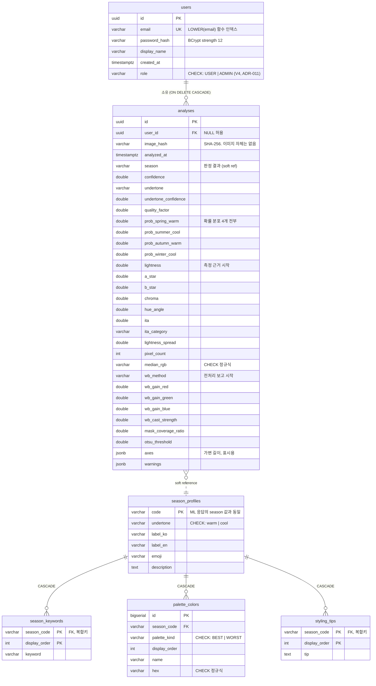

# 09. 데이터 모델

이 문서는 PostgreSQL 스키마의 **설계 근거**를 설명합니다. 테이블이 무엇인지가 아니라 왜 그렇게 생겼는지를 다룹니다. 실제 DDL은 `backend/backend-infrastructure/src/main/resources/db/migration/` 에 있습니다.

---

## 전체 그림



스키마는 두 덩어리입니다. **왼쪽(users·analyses)은 사용자가 만드는 데이터**, **오른쪽(season_*)은 우리가 큐레이션한 참조 데이터**입니다. 둘을 잇는 것은 `analyses.season` ↔ `season_profiles.code` 하나뿐이고, 그마저 물리적 FK가 아닙니다(아래 §3).

---

## 1. 가장 중요한 것은 **없는 컬럼**입니다

`analyses` 테이블에는 이미지를 담는 컬럼이 없습니다. `BYTEA`도, S3 키도, 파일 경로도 없습니다.

### 왜

얼굴 사진은 개인정보입니다. 보관하기 시작하면 따라오는 것들이 있습니다 — 보관 기간 정책, 삭제 요청 처리, 저장 시 암호화, 접근 통제, 유출 시 통지 의무. 이 프로젝트가 얻는 가치("이력에서 원본 다시 보기")에 비해 감당할 것이 너무 많습니다.

그래서 남기는 것은 셋뿐입니다.

| 남기는 것 | 용도 |
|---|---|
| `image_hash` (SHA-256) | 캐시 키이자 "같은 사진인가" 판별자 |
| 측정 수치 (L\*, a\*, b\*, C\*, h°, ITA° 등) | 이력 화면의 3축 게이지, 재판정 없이 결과 재현 |
| `median_rgb` | 이력 목록의 색 칩 |

### 어떻게 강제하나

정책을 문서에만 적으면 6개월 뒤 누군가 "이력에서 사진 보여주면 좋겠는데"라며 컬럼을 추가합니다. 세 겹으로 막았습니다.

**① 스키마에 컬럼이 없음** — 추가하려면 마이그레이션을 새로 써야 하고, 그 순간 리뷰에 걸립니다.

**② 테스트가 스키마를 감시함**

```java
// PersistenceIntegrationTest.schemaCannotStoreImages
List<String> columns = jdbc.queryForList(
        "SELECT column_name FROM information_schema.columns WHERE table_name = 'analyses'",
        String.class);

assertThat(columns)
        .noneMatch(c -> c.contains("image_data"))
        .noneMatch(c -> c.contains("image_blob"))
        .noneMatch(c -> c.contains("photo"))
        .contains("image_hash");
```

**③ 도메인 타입이 분리됨** — 저장되는 `AnalysisRecord`와 저장되지 않는 `StageImages`가 다른 타입입니다. 영속화 경로에 단계 이미지가 실수로 흘러들려면 타입을 바꿔야 합니다.

### 대가

**"이력에서 원본 다시 보기"가 불가능합니다.** 이력 화면은 색 칩과 3축 게이지로 구성됩니다. 이것은 기술적 한계가 아니라 의도적 포기이므로 UI에 그 사실을 명시합니다.

---

## 2. 확률 분포를 4개 컬럼으로 펼친 이유

```sql
prob_spring_warm  DOUBLE PRECISION NOT NULL,
prob_summer_cool  DOUBLE PRECISION NOT NULL,
prob_autumn_warm  DOUBLE PRECISION NOT NULL,
prob_winter_cool  DOUBLE PRECISION NOT NULL,
```

최상위 계절(`season` 컬럼)만 저장하는 쪽이 단순합니다. 그러지 않은 이유는 **두 결과를 나중에 구분할 수 없기 때문**입니다.

| 케이스 | `season` | 실제 분포 |
|---|---|---|
| 확실 | `winter_cool` | 97 / 1 / 1 / 1 |
| 경계 | `spring_warm` | **35 / 32 / 18 / 15** |

둘 다 `season` 하나만 보면 똑같습니다. 분포를 버리면 "이 사용자는 봄과 여름 사이였다"는 정보가 영구히 사라지고, Step 5에서 규칙 엔진과 CNN을 비교할 때 쓸 재료도 없어집니다.

`jsonb` 하나에 담을 수도 있었지만 펼쳤습니다. **집계 대상이기 때문**입니다 — "경계 케이스가 전체의 몇 %인가", "여름 쿨 확률의 분포는 어떤가" 같은 질의가 Step 5 평가에서 필요하고, 그때 `jsonb` 연산자로 파고드는 것보다 컬럼이 낫습니다.

같은 기준을 `axes`와 `warnings`에는 반대로 적용했습니다. 길이가 가변이고 집계 대상이 아니며 화면 표시용이므로 `jsonb`입니다.

> **규칙** — 조회·집계 조건이 되는 값은 평면 컬럼, 표시용 가변 구조는 `jsonb`.

---

## 3. `analyses.season`이 FK가 아닌 이유

```sql
season VARCHAR(20) NOT NULL,   -- FK 아님
```

의도적입니다. 근거는 둘입니다.

**① 이 값은 역사적 스냅샷입니다.** "2026년 8월에 이렇게 판정했다"는 기록이고, 카탈로그가 나중에 바뀌어도 과거 기록은 그대로여야 합니다. FK가 있으면 계절 정의를 손대는 순간 과거 이력이 인질이 됩니다.

**② 마이그레이션 순서 문제도 있습니다.** `analyses`(V1)가 `season_profiles`(V2)보다 먼저 생성됩니다. FK를 걸려면 V2 이후로 미뤄야 하는데, 그렇게까지 할 만큼의 이득이 없다고 봤습니다.

### 그럼 무결성은 누가 지키나

FK를 뺀 대신 **세 겹의 애플리케이션 검증**이 있습니다.

```java
// Season.fromCode — 모르는 코드를 조용히 통과시키지 않는다
public static Season fromCode(String code) {
    for (Season season : values()) {
        if (season.code.equals(code)) return season;
    }
    throw new IllegalArgumentException(
            "알 수 없는 계절 코드입니다: " + code + " — ml-service와 계약이 어긋났습니다.");
}
```

| 검증 | 위치 | 무엇을 막나 |
|---|---|---|
| `Season.fromCode()` | 도메인 (읽기·쓰기 양방향) | 모르는 코드가 도메인에 들어오는 것 |
| `test_season_codes_match_palette_export` | ML 서비스 테스트 | ML 코드 ≠ DB 시드 코드 |
| `joinsMeasurementWithCatalog` | 종단 통합 테스트 | Python·Java·DB 세 곳의 코드 불일치 |

**솔직한 평가:** 계절이 4개로 고정되어 있고 enum으로 강제되므로 실무상 위험은 낮습니다. 다만 순수하게 데이터 무결성 관점에서는 FK가 더 강한 보장이고, "역사적 스냅샷"이라는 논거도 계절 코드가 실제로 바뀔 일이 없다면 다소 이론적입니다. **재검토 조건**: 계절 코드 체계가 8타입 등으로 확장될 때 (ADR-003).

---

## 4. 제약조건 — DB가 직접 거부하는 것들

애플리케이션이 검증한다고 DB를 열어두지 않았습니다. 두 겹입니다.

```sql
CONSTRAINT ck_analyses_median_rgb CHECK (median_rgb ~ '^#[0-9A-F]{6}$')
CONSTRAINT ck_palette_hex         CHECK (hex ~ '^#[0-9A-F]{6}$')
CONSTRAINT ck_palette_kind        CHECK (palette_kind IN ('BEST', 'WORST'))
CONSTRAINT ck_season_undertone    CHECK (undertone IN ('warm', 'cool'))
```

**HEX를 대문자로 못 박은 것**이 실질적입니다. 저장 형식이 갈리면 `#FF7F50`과 `#ff7f50`이 다른 값이 되어 비교·중복 검사가 어긋납니다. 통합 테스트가 이 제약이 실제로 동작하는지 확인합니다.

```java
// hexConstraintRejectsLowercase
assertThatThrownBy(() -> jdbc.update(
        "INSERT INTO palette_colors (…, hex) VALUES ('spring_warm', 'BEST', 999, '테스트', '#ff7f50')"))
        .hasMessageContaining("ck_palette_hex");
```

`ENUM` 타입 대신 `VARCHAR + CHECK`를 쓴 이유는 마이그레이션 편의입니다. PostgreSQL `ENUM`에 값을 추가하는 것은 되지만 제거·변경은 까다롭고, JPA 매핑도 번거로워집니다.

---

## 5. 인덱스

| 인덱스 | 정의 | 대상 쿼리 |
|---|---|---|
| `ix_analyses_user_recent` | `(user_id, analyzed_at DESC)` | 이력 조회는 **항상** "내 것을, 최신순으로" |
| `ix_analyses_image_hash` | `(image_hash)` | 같은 사진 재업로드 판별 |
| `ux_users_email_lower` | `LOWER(email)` UNIQUE | 로그인, 중복 가입 차단 |
| `ix_palette_colors_season` | `(season_code, palette_kind, display_order)` | 팔레트 조회 |

### `LOWER(email)` 함수 인덱스

`Foo@Example.com`과 `foo@example.com`은 같은 사서함입니다. 정규화 없이 저장하면 서로 다른 계정이 만들어집니다.

**두 겹으로 막았습니다.** 도메인의 `Email.normalize()`가 항상 소문자로 만들고, DB의 함수 유니크 인덱스가 최종 방어선입니다. 애플리케이션 검사만 있으면 두 요청이 동시에 통과하는 경쟁 조건이 남습니다.

```java
// RegisterUser — 경쟁 조건을 인지하고 남겨둔 코드
// DB의 LOWER(email) 유니크 인덱스가 최종 방어선이고,
// 이 검사는 흔한 경우에 친절한 메시지를 주기 위한 것이다.
if (users.existsByEmail(normalizedEmail)) {
    throw new EmailAlreadyUsedException(normalizedEmail);
}
```

`citext` 확장을 쓰지 않은 이유는 확장 설치가 배포 환경마다 다른 절차를 요구하기 때문입니다. 함수 인덱스로 같은 보장을 얻습니다.

### 복합 인덱스의 컬럼 순서

`(user_id, analyzed_at DESC)`에서 `user_id`가 앞입니다. 이력 조회는 **항상** 사용자로 먼저 좁히고 그 안에서 정렬하기 때문입니다. 순서를 뒤집으면 전체 스캔 후 필터가 되어 인덱스가 사실상 무용해집니다.

---

## 6. 카탈로그 테이블을 넷으로 나눈 이유

`season_profiles` 하나에 팔레트를 `jsonb`로 넣을 수도 있었습니다. 정규화한 이유는 **순서와 제약** 때문입니다.

- `display_order`가 명시적 컬럼이라 팔레트 순서가 데이터에 남습니다. UI의 "대표 색"은 첫 번째 색이고, 순서가 뒤집히면 화면이 바뀝니다.
- HEX 형식 `CHECK`가 색마다 걸립니다. `jsonb` 안에서는 이런 제약을 걸 수 없습니다.
- `UNIQUE (season_code, palette_kind, display_order)`로 같은 자리에 두 색이 들어가는 것을 막습니다.

`season_keywords`와 `styling_tips`는 **대리키 없이 복합키**(`season_code`, `display_order`)를 씁니다. 순서가 곧 정체성인 값이라 별도 id를 둘 이유가 없습니다. 반면 `palette_colors`는 `BIGSERIAL` 대리키를 씁니다 — JPA `@OneToMany` 매핑에서 대리키가 다루기 편하고, 향후 색 단위로 참조될 여지가 있기 때문입니다.

---

## 7. 시드는 생성물입니다

`V3__seed_season_catalog.sql`(91줄, 색상 48개)은 **손으로 쓰지 않았습니다.**

```bash
cd ml-service && uv run python scripts/export_palettes.py --format sql \
    -o ../backend/backend-infrastructure/src/main/resources/db/migration/V3__seed_season_catalog.sql
```

Python 도메인(`app/domain/seasons.py`)이 유일한 원천이고 SQL은 파생물입니다. 사람이 색상 코드를 옮겨 적으면 오타가 나고, 그 오타는 UI에 이상한 색이 뜰 때까지 발견되지 않습니다.

파일 첫 줄에 생성물임을 명시했습니다.

```sql
-- 이 파일은 생성물입니다. 직접 편집하지 마세요.
-- 원본: ml-service/app/domain/seasons.py
```

**Python 도메인에 팔레트가 남아 있는 이유**는 규칙 엔진이 ADR-002의 영구 폴백이기 때문입니다. 폴백이 동작하려면 계절 정의가 그쪽에도 있어야 합니다. 다만 **HTTP 응답으로는 나가지 않습니다** — 소유권은 DB에 있습니다.

이중성이 남는 것은 사실이며, 코드 일치를 테스트로 묶어 관리합니다.

---

## 8. 마이그레이션 운영

| 버전 | 내용 |
|---|---|
| `V1__create_core_tables.sql` | `users`, `analyses` + 인덱스 |
| `V2__create_season_catalog.sql` | 카탈로그 4테이블 |
| `V3__seed_season_catalog.sql` | 시드 (생성물) |

**`spring.jpa.hibernate.ddl-auto=validate`** 입니다. 스키마는 Flyway가 소유하고, Hibernate는 엔티티와 실제 스키마가 어긋나면 **기동을 거부**합니다.

이 설정이 실제로 값을 했습니다. 개발 중 `image_hash`를 `CHAR(64)`로 선언했는데 엔티티는 `varchar(64)`를 기대해서 기동이 실패했습니다.

```
Schema validation: wrong column type encountered in column [image_hash] in table [analyses];
found [bpchar (Types#CHAR)], but expecting [varchar(64) (Types#VARCHAR)]
```

찾아보니 PostgreSQL의 `CHAR`는 공백으로 패딩하고 비교 시 무시하는 타입이라 해시 저장에도 부적절했습니다. `VARCHAR`로 통일했습니다. `ddl-auto=update`였다면 Hibernate가 조용히 컬럼을 바꾸거나 넘어갔을 문제입니다.

---

## 9. 남은 것

**페이지네이션이 없습니다.** 이력 조회는 `limit`만 받고 최대 50건입니다. 커서 기반 페이지네이션은 이력이 실제로 쌓이면 추가합니다.

**소프트 삭제가 없습니다.** 사용자를 지우면 이력이 `CASCADE`로 사라집니다. 개인정보 최소 보관 원칙과는 맞지만, 실수로 지웠을 때 복구 수단이 없습니다.

**감사 로그가 없습니다.** 누가 언제 무엇을 조회했는지 남지 않습니다.

**파티셔닝을 고려하지 않았습니다.** `analyses`가 수천만 행이 되면 `analyzed_at` 기준 파티셔닝이 필요하지만, 지금 단계에서는 과설계입니다.
